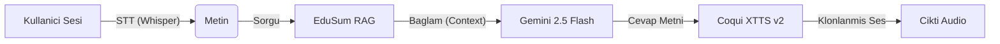

# EduSum Ses Asistani (The Voice)

> **Yeni Nesil Egitim Odakli Sesli Etkilesim Motoru**
> _Gemini 2.5 Flash ve Coqui XTTS v2 ile Guclendirilmis Gercek Zamanli Pipeline_


## Teknik Mimari ve Modeller

Bu modul, sesi metne, metni bilgiye, bilgiyi tekrar insansi sese donusturen 4 asamali bir boru hattidir (pipeline).

### 1. Beyin: Google Gemini 2.5 Flash
- **Model:** `gemini-2.5-flash` (En guncel, dusuk gecikmeli surum).
- **Rolu:** RAG kutuphanesinden gelen ham ders notlarini, bir "Lise Ogretmeni" edasiyla isler.
- **Konfigurasyon:** `temperature=0.3` (Halusinasyonu onlemek icin dusuk yaraticilik), `max_tokens=500` (Kisa ve oz cevaplar).

### 2. Ses Uretimi: Coqui XTTS v2
- **Model:** `coqui/XTTS-v2`
- **Ozellik:** **Zero-Shot Voice Cloning** (Sifir Atisli Ses Kopyalama).
- **Calisma Prensibi:** Sisteme verilen sadece 3 saniyelik bir `wav` dosyasindaki (`speaker_reference`) tiniyi (timbre) ve tonu analiz eder. Uretilen cevabi o kisinin sesiyle okur.

### 3. Ses Isleme: Librosa & SoundFile
- **Kutuphaneler:** `librosa`, `soundfile`, `numpy`.
- **Gorev:** Gelen farkli formatlardaki (mp3, m4a, ogg) sesleri standart `22050Hz Mono WAV` formatina donusturur ve gurultuden arindirir.

---

## Akis Semasi (Workflow)



---

## Prompt Muhendisligi (System Prompt)
Sistemin kullandigi LLM, "Dogruluk" ve "Pedagoji" odakli kati kurallarla yonetilir:
- **Asla Uydurma (No Hallucination):** Sadece RAG'dan gelen PDF parcalarini kullanir.
- **Format Kontrolu:** "Nedir?" sorularina tanim cumlesiyle, "Yorumla" sorularina metaforla baslar.
- **Kisilik:** Bir Lise Ders Asistani gibi resmi ama anlasilir konusur.

---

## Kullanim

```bash
# Servisi Baslat (FastAPI - Uvicorn)
python run_voice_prod.py
```

**Ornek Istek (cURL):**
```bash
curl -X POST "http://localhost:8001/ask" \
     -F "audio=@soru.wav" \
     -F "ref_audio=@ahmet_hoca.wav"
```

---
*Egitimin yeni sesi.*
